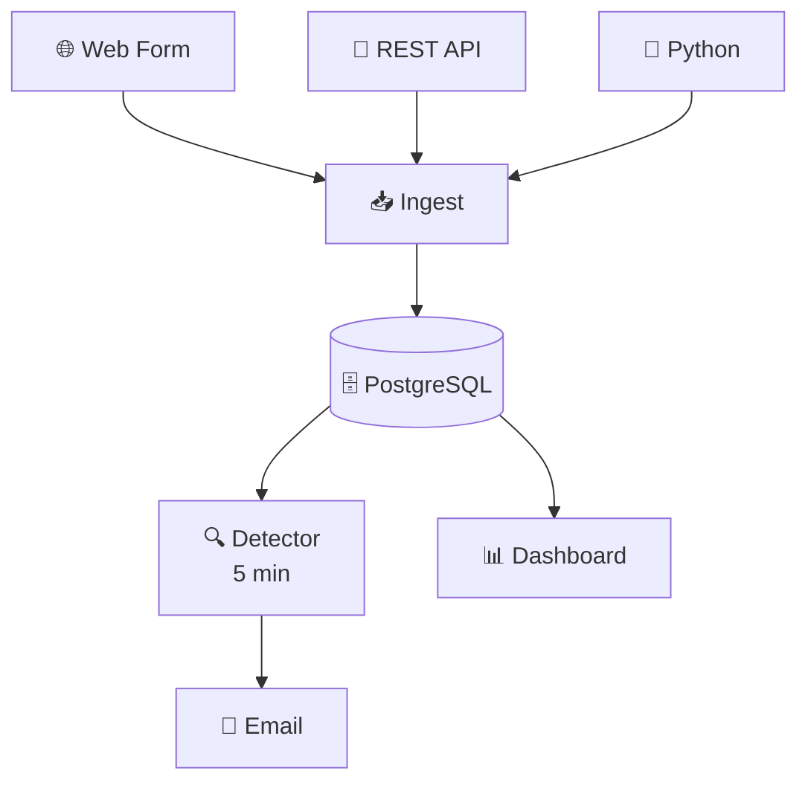
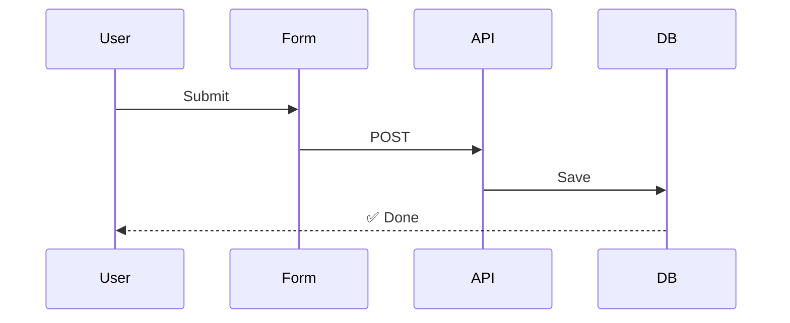
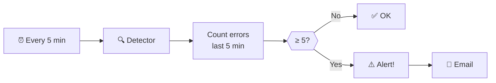
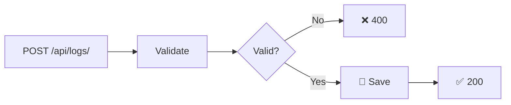
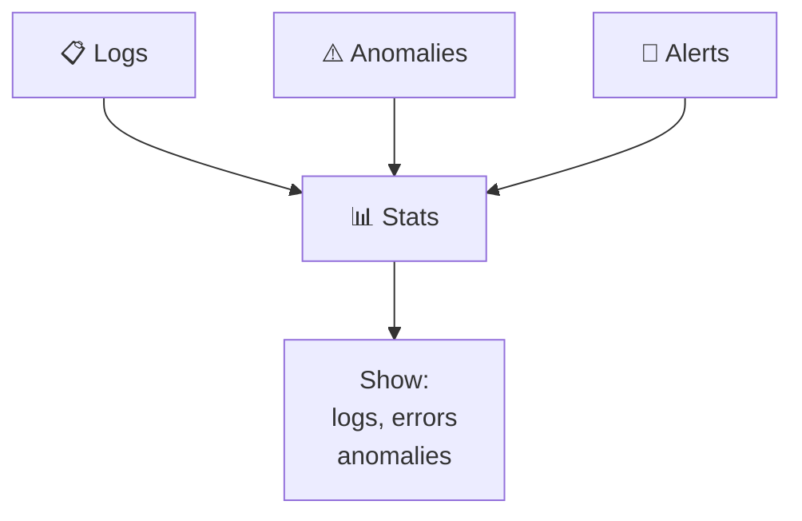
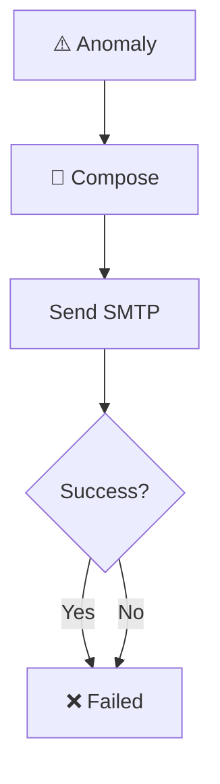
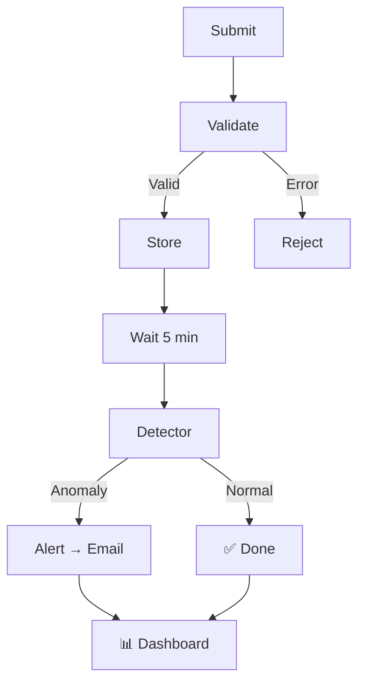

# 🔄 Flow Diagrams

Visual guide to system workflows.

---

## 1️⃣ Architecture

---

## 2️⃣ Submit Log

---

## 3️⃣ Detect Anomaly

---

## 4️⃣ REST API

---

## 5️⃣ Dashboard

---

## 6️⃣ Email Alert

---

## 7️⃣ Log Lifecycle

---

## 📝 Components

| File | Purpose |
|------|---------|
| `urls.py` | URL routing |
| `views.py` | Requests |
| `models.py` | Database |
| `serializers.py` | Validation |
| `anomaly_engine.py` | Detection |
| `alerts.py` | Email |

---

**Threshold**: 5 errors | **Interval**: 5 min | **Mail**: Gmail
